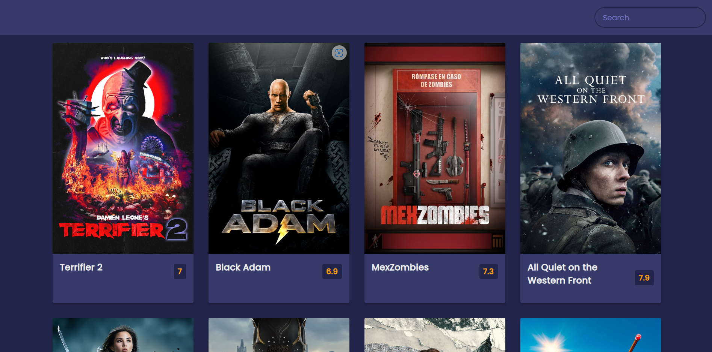

# Projeto de app de filmes

> 📷 Imagem do projeto

 

 [Acesse](https://prdsilva80.github.io/app-filme/)

---

## 🛠️ Tecnologias Utilizadas

  

---

## 👨‍🎓 O que aprendi

- Como deixar o site responsivo com o Javascript
- Entender melhor a lógica do Js
- Buscar uma API para ser consumida pela aplicação
- Buscar informações para apresentar o projeto

---

## 📧 Contato

 <a href = "mailto:probertos717@gmail.com">
